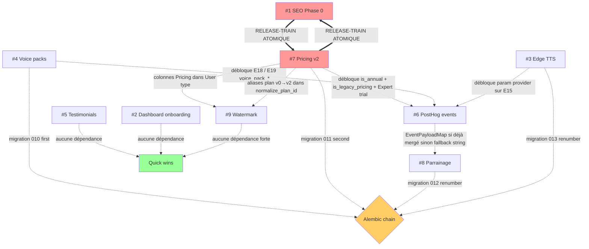

# Release Orchestration — DeepSight Audit Kimi 2026-04-29

> **Statut :** Document méta-cohérence (PAS un plan d'implémentation). Audit transversal des **9 plans datés 2026-04-29** pour identifier conflits, dépendances cycliques et produire la roadmap d'exécution.
>
> **Périmètre audité** (par ordre alphabétique de slug) :
>
> 1. `audit-kimi-phase-0-seo-securite` — SEO + headers Vercel + ProductJsonLd + prix v2
> 2. `dashboard-onboarding-empty-states` — Sidebar rename + Onboarding 3 étapes + EmptyState
> 3. `edge-tts-gratuit` — Provider TTS gratuit (Microsoft Edge) + table `voice_edge_quota`
> 4. `elevenlabs-voice-packs` — Top-up minutes ElevenLabs + table `voice_credit_packs`
> 5. `homepage-testimonials` — Testimonials + TrustBadges + SocialProofCounter + endpoint public
> 6. `posthog-events-complets` — 18 events PostHog typés + `EventPayloadMap`
> 7. `pricing-v2-stripe-grandfathering` — Renaming plus→pro, pro→expert + Stripe + grandfathering
> 8. `programme-parrainage` — Table `referrals` + endpoints `/api/referral/*` + ReferralWidget
> 9. `watermark-exports-gratuits` — Watermark sur 6 formats d'export Free
>
> Le 10ᵉ plan présent (`merge-voice-chat-context-implementation`) n'est PAS dans le périmètre demandé et est ignoré.

---

## Executive summary

- **Conflit Alembic critique résolu** : 3 plans revendiquent simultanément la migration `010` (voice-packs, edge-tts, parrainage). Le plan edge-tts est le seul à anticiper le conflit. **Renumérotation imposée** : voice-packs reste `010`, pricing-v2 reste `011`, parrainage devient `012`, edge-tts devient `013`.
- **Couplage atomique obligatoire** : `audit-kimi-phase-0-seo-securite` (#1) et `pricing-v2-stripe-grandfathering` (#7) **DOIVENT merger ensemble** via release-train, sinon incohérence publique annoncée 8,99 € / facturée 5,99 €. Les deux plans le mentionnent explicitement.
- **Drift business value** : la grille de prix utilisée par les plans diverge — v0 (Plus 4,99 € / Pro 9,99 €), v1 (Pro 5,99 € / Expert 14,99 €), v2 (Pro 8,99 € / Expert 19,99 €) cohabitent dans la base de code. Les plans v2 uniformisent vers Pro 8,99 € / Expert 19,99 € — alignement complet.
- **Dépendances PostHog** : 4 events sur 18 sont **bloqués** par d'autres plans (`pricing_toggle_changed`, `plan_selected.is_annual`, `trial_started.expert`, voice packs E18/E19). Le plan #6 le documente et déclare quand même les constantes pour éviter les conflits de PR ultérieurs.
- **Quick wins indépendants identifiés** : #5 testimonials (autonome côté front, mini route backend), #2 dashboard onboarding (front-only), #9 watermark (back-only avec normalisation `plus|pro` legacy → compatible v1 et v2).

**Recommandation top-line** : démarrer Sprint A (quick wins) en parallèle pendant que Sprint B (release-train pricing) est préparé. Sprint B est le bottleneck — sans lui, #6 #8 #9 sont bloqués sur des type changes.

---

## A — Alembic migration order

### Conflits revendiqués (lecture des plans)

| Plan           | Migration revendiquée           | `down_revision` revendiqué        | Anticipe le conflit ?                                     |
| -------------- | ------------------------------- | --------------------------------- | --------------------------------------------------------- |
| #4 voice-packs | `010_add_voice_credit_packs.py` | `"009"`                           | Non (revendique 010 first-come)                           |
| #7 pricing-v2  | `011_pricing_v2_rename.py`      | `"010"` (avec note "vérifier")    | Partiellement (mention "010 ou 009")                      |
| #8 parrainage  | `010_add_referrals.py`          | `"009_add_user_preferences_json"` | Non (utilise revision_id `"010_add_referrals"`)           |
| #3 edge-tts    | `010_add_voice_edge_quota.py`   | `"009"` (avec note "ou 011")      | Oui — explicite : « si voice-packs mergé : utiliser 011 » |

État prod actuel (vérifié `backend/alembic/versions/`) : dernière migration **`009_add_user_preferences_json.py`**.

### Renumérotation imposée

L'ordre de merge optimal (justifié en section E) implique la séquence suivante :

```
009 (prod actuel)
 └─→ 010_add_voice_credit_packs       ← plan #4 voice-packs (mergeable seul, indépendant)
      └─→ 011_pricing_v2_rename       ← plan #7 pricing-v2 (release-train avec #1)
           └─→ 012_add_referrals      ← plan #8 parrainage (renumérotation : 010 → 012)
                └─→ 013_add_voice_edge_quota  ← plan #3 edge-tts (renumérotation : 010 → 013)
```

### Actions concrètes par plan

| Plan           | Action requise dans le fichier de migration                                                                                                                                                                                                          |
| -------------- | ---------------------------------------------------------------------------------------------------------------------------------------------------------------------------------------------------------------------------------------------------- |
| #4 voice-packs | **Aucune** — garde `revision = "010"`, `down_revision = "009"`. Premier mergé.                                                                                                                                                                       |
| #7 pricing-v2  | **Aucune** si #4 mergé avant — garde `revision = "011"`, `down_revision = "010"`. Le plan inclut déjà la directive « vérifier 010 ou 009 ».                                                                                                          |
| #8 parrainage  | **Renommer fichier** `010_add_referrals.py` → `012_add_referrals.py`. **Modifier** `revision = "012_add_referrals"`, `down_revision = "011"`.                                                                                                        |
| #3 edge-tts    | **Renommer fichier** `010_add_voice_edge_quota.py` → `013_add_voice_edge_quota.py`. **Modifier** `revision = "013"`, `down_revision = "012_add_referrals"`. La directive « si voice-packs mergé : 011 » devient obsolète — utiliser 013 directement. |

### Tables / colonnes touchées (récap)

| Migration         | Tables créées                                  | Colonnes ajoutées                                                                         |
| ----------------- | ---------------------------------------------- | ----------------------------------------------------------------------------------------- |
| `010` voice-packs | `voice_credit_packs`, `voice_credit_purchases` | `voice_quota_streaming.purchased_minutes`                                                 |
| `011` pricing-v2  | (aucune)                                       | `users.is_legacy_pricing` (Boolean) + UPDATE atomique `users.plan` (plus→pro, pro→expert) |
| `012` parrainage  | `referrals` (+ enum `referral_status`)         | `users.referral_code` (String 64, UNIQUE, nullable, indexed)                              |
| `013` edge-tts    | `voice_edge_quota`                             | (aucune nouvelle colonne sur tables existantes)                                           |

**Aucun conflit de colonne** entre les 4 migrations — chacune ajoute soit une nouvelle table, soit une colonne unique distincte sur `users`.

### Risque ordre vs déploiement

L'auto-deploy DeepSight applique les migrations en cascade via `entrypoint.sh + RUN_MIGRATIONS=true` (cf. mémoire `reference_deepsight-hetzner-auto-deploy.md`). Le pipeline tourne **alphabétiquement par nom de fichier** — la renumérotation 010 / 011 / 012 / 013 garantit l'ordre.

---

## B — Multi-touched files

### Vue matricielle

Légende : ✏️ Modify, ✨ Create

| Fichier                                           | #1 SEO | #2 Dash | #3 Edge | #4 Packs | #5 Testi | #6 PH | #7 Price | #8 Parr | #9 WM |
| ------------------------------------------------- | ------ | ------- | ------- | -------- | -------- | ----- | -------- | ------- | ----- |
| `backend/src/billing/plan_config.py`              |        |         |         |          |          |       | ✏️       |         | (lit) |
| `backend/src/billing/router.py`                   |        |         |         | ✏️       |          |       | ✏️       |         |       |
| `backend/src/billing/voice_quota.py`              |        |         | (lit)   | ✏️       |          |       | ✏️       |         |       |
| `backend/src/db/database.py`                      |        |         | ✏️      | ✏️       |          |       | ✏️       | ✏️      |       |
| `backend/src/main.py`                             |        |         | ✏️      | ✏️       | ✏️       |       |          | ✏️      |       |
| `backend/src/exports/service.py`                  |        |         |         |          |          |       |          |         | ✏️    |
| `backend/src/exports/pdf_generator.py`            |        |         |         |          |          |       |          |         | ✏️    |
| `backend/src/exports/templates/pdf_template.html` |        |         |         |          |          |       |          |         | ✏️    |
| `backend/src/exports/router.py`                   |        |         |         |          |          |       |          |         | ✏️    |
| `backend/src/auth/router.py`                      |        |         |         |          |          |       |          | ✏️      |       |
| `backend/src/auth/schemas.py`                     |        |         |         |          |          |       |          | ✏️      |       |
| `backend/src/auth/service.py`                     |        |         |         |          |          |       |          | ✏️      |       |
| `backend/src/videos/router.py`                    |        |         |         |          |          |       |          | ✏️      |       |
| `backend/src/voice/router.py`                     |        |         | ✏️      |          |          |       |          |         |       |
| `backend/src/voice/schemas.py`                    |        |         | ✏️      |          |          |       |          |         |       |
| `backend/src/tts/providers.py`                    |        |         | ✏️      |          |          |       |          |         |       |
| `backend/src/core/config.py`                      |        |         |         |          |          |       | ✏️       |         |       |
| `backend/src/landing/router.py` (nouveau)         |        |         |         |          | ✨       |       |          |         |       |
| `frontend/src/services/api.ts`                    |        | ✏️      | ✏️      | ✏️       | ✏️       | (lit) | ✏️       | ✏️      |       |
| `frontend/src/services/analytics.ts`              |        |         |         |          |          | ✏️    |          | (lit)   |       |
| `frontend/src/services/analytics.types.ts`        |        |         |         |          |          | ✨    |          |         |       |
| `frontend/src/config/planPrivileges.ts`           |        |         |         |          |          |       | ✏️       |         |       |
| `frontend/src/pages/UpgradePage.tsx`              | ✏️     |         |         |          |          | ✏️    | ✏️       |         |       |
| `frontend/src/pages/MyAccount.tsx`                |        |         |         | ✏️       |          | ✏️    |          | ✏️      |       |
| `frontend/src/pages/LandingPage.tsx`              |        |         |         |          | ✏️       | ✏️    |          | ✏️      |       |
| `frontend/src/pages/VoiceCallPage.tsx`            |        |         | ✏️      | ✏️       |          | ✏️    |          |         |       |
| `frontend/src/pages/PaymentSuccess.tsx`           |        |         |         |          |          | ✏️    |          |         |       |
| `frontend/src/pages/Login.tsx`                    |        |         |         |          |          | ✏️    |          |         |       |
| `frontend/src/pages/Register.tsx`                 |        |         |         |          |          |       |          | ✏️      |       |
| `frontend/src/components/layout/Sidebar.tsx`      |        | ✏️      |         |          |          |       |          |         |       |
| `frontend/src/hooks/useAnalytics.ts`              |        |         |         |          |          | ✏️    |          |         |       |
| `frontend/src/components/voice/voiceAnalytics.ts` |        |         | (lit)   | (lit)    |          | ✏️    |          |         |       |
| `frontend/src/components/analysis/ExportMenu.tsx` |        |         |         |          |          | ✏️    |          |         | ✏️    |
| `frontend/src/store/analysisStore.ts`             |        |         |         |          |          | ✏️    |          |         |       |
| `frontend/src/i18n/fr.json` + `en.json`           |        | ✏️      |         |          | ✏️       |       |          | ✏️      | ✏️    |
| `frontend/index.html`                             | ✏️     |         |         |          |          |       |          |         |       |
| `frontend/vercel.json`                            | ✏️     |         |         |          |          |       |          |         |       |

### Conflits ligne / ordre optimal — fichiers à 3+ plans

#### 🔴 `backend/src/db/database.py` — 4 plans (#3, #4, #7, #8)

**Risque** : 4 modifications concurrentes du fichier User et nouvelles classes ajoutées en bas.

**Ordre optimal** :

1. **#4 voice-packs** mergé en premier — ajoute `purchased_minutes` à `VoiceQuotaStreaming` + crée classes `VoiceCreditPack`, `VoiceCreditPurchase` en bas du fichier.
2. **#7 pricing-v2** ensuite — ajoute colonne `is_legacy_pricing: Boolean` à `User`. Pas de conflit avec #4 (zone User vs zones VoiceQuotaStreaming/bas-fichier).
3. **#8 parrainage** ensuite — ajoute `referral_code` à `User` (sous `is_legacy_pricing`) + classe `Referral` en bas du fichier (sous `VoiceCreditPurchase`).
4. **#3 edge-tts** en dernier — ajoute classe `VoiceEdgeQuota` en bas du fichier (sous `Referral`).

**Pas de collision physique** car chaque plan ajoute soit dans la classe `User` (lignes ~106-185, mais à des emplacements différents), soit une nouvelle classe en bas du fichier. Conflit `git merge` géré naturellement par l'ordre.

#### 🟡 `frontend/src/services/api.ts` — 6 plans touchent le fichier (#2, #3, #4, #5, #7, #8) + #6 le lit pour types

**Risque** : 6 modifications concurrentes du `User` interface + 5+ nouveaux objets `XApi`.

**Ordre optimal** :

1. **#7 pricing-v2** en premier — réécrit `PlanId = "free" | "pro" | "expert"` (le plus impactant).
2. **#2 dashboard** ensuite — ajoute `preferences?: Record<string, unknown>` au `User`.
3. **#4 voice-packs** ajoute `voicePacksApi` (nouvel objet, zéro conflit).
4. **#3 edge-tts** ajoute `voiceApi.startEdgeSession/sendEdgeTurn/getEdgeQuota` (étend objet existant).
5. **#5 testimonials** ajoute `landingApi` (nouvel objet, zéro conflit).
6. **#8 parrainage** ajoute `referralApi` (nouvel objet, zéro conflit).

**Conflit de ligne probable** : `User` interface lignes 28-57. Mitigation : merger #7 puis rebase #2 dessus.

#### 🟡 `frontend/src/pages/UpgradePage.tsx` — 3 plans (#1, #6, #7)

**Risque** : refonte complète UI dans #7 vs ajout JSON-LD dans #1 vs instrumentation events dans #6.

**Ordre optimal** :

1. **#7 pricing-v2** refait l'UI avec toggle annuel + ComparisonTable (ligne 1-1700).
2. **#1 SEO** ajoute `<ProductJsonLd />` import + insertion au début du composant (zone Helmet).
3. **#6 PostHog** instrumente sur le UI #7 (events `pricing_viewed`, `plan_selected`, `checkout_started`).

**Couplage atomique #1 + #7** rend l'ordre simple : merger les deux ensemble dans `release/pricing-v2` ; #6 vient en sprint suivant.

#### 🟡 `frontend/src/pages/MyAccount.tsx` — 3 plans (#4, #6, #8)

**Risque** : 2 widgets ajoutés (`<VoicePacksWidget>` et `<ReferralWidget>`) + instrumentation cancel.

**Ordre optimal** :

1. **#4 voice-packs** ajoute `<VoicePacksWidget>` dans section "Voice & Audio".
2. **#8 parrainage** ajoute `<ReferralWidget>` entre section "Plan" et "API key".
3. **#6 PostHog** instrumente `handleCancelSubscription` (zone existante, pas de conflit avec #4/#8).

**Pas de collision** car chaque widget va dans une section distincte.

#### 🟡 `frontend/src/pages/LandingPage.tsx` — 3 plans (#5, #6, #8)

**Risque** : 3 sections ajoutées (#5) + instrumentation hero/footer (#6) + détection `?ref=` (#8).

**Ordre optimal** :

1. **#5 testimonials** ajoute 3 sections (3 points d'insertion identifiés par le plan).
2. **#8 parrainage** ajoute `useEffect` au mount pour détecter `?ref=`.
3. **#6 PostHog** instrumente E1 (`hero_analysis_clicked`) + E2 (`signup_started`).

**Pas de collision** — zones disjointes.

#### 🟡 `frontend/src/components/analysis/ExportMenu.tsx` — 2 plans (#6, #9)

**Risque** : ajout tooltip watermark (#9) + instrumentation export (#6).

**Ordre optimal** : #9 d'abord (modifie le rendu), puis #6 (ajoute call analytics dans le handler). Aucune zone partagée.

---

## C — Business values consistency check

### Prix mensuels

| Valeur             | #1 SEO              | #3 Edge | #4 Packs | #5 Testi | #6 PH | #7 Price            | #9 WM | Cohérence                      |
| ------------------ | ------------------- | ------- | -------- | -------- | ----- | ------------------- | ----- | ------------------------------ |
| Pro **8,99 €**     | ✅                  | (n/a)   | (n/a)    | (n/a)    | (n/a) | ✅                  | (n/a) | ✅ Cohérent                    |
| Expert **19,99 €** | ✅                  | (n/a)   | (n/a)    | (n/a)    | (n/a) | ✅                  | (n/a) | ✅ Cohérent                    |
| Pro v1 5,99 €      | mention "legacy v1" | (n/a)   | (n/a)    | (n/a)    | (n/a) | mention "legacy v1" | (n/a) | ✅ Cohérent (déclaré obsolète) |

### Allowance ElevenLabs

| Valeur                      | #3 Edge | #4 Packs | #6 PH | #7 Price | Cohérence   |
| --------------------------- | ------- | -------- | ----- | -------- | ----------- |
| Pro 30 min/mois rolling     | ✅ H2   | ✅ H1    | (n/a) | ✅ H4    | ✅ Cohérent |
| Expert 120 min/mois rolling | ✅ H2   | ✅ H1    | (n/a) | ✅ H4    | ✅ Cohérent |

⚠ **Décision DA voice-packs encore ouverte** — le plan #4 mentionne « statu quo Pro 30 / Expert 30 ou Pro 30 / Expert 120 ». Plan #7 et #3 supposent **Pro 30 / Expert 120**. Le default à locker est **Pro 30 / Expert 120** pour la cohérence inter-plans.

### Plan IDs

| Forme                                               | #4 Packs | #7 Price | #9 WM | Cohérence                           |
| --------------------------------------------------- | -------- | -------- | ----- | ----------------------------------- |
| `TOP_TIER_PLANS = {"pro", "expert"}`                | ✅       | ✅       | -     | ✅                                  |
| `normalize_plan_id` (legacy `etudiant/starter/...`) | -        | ✅       | ✅    | ✅                                  |
| Plans payants `{plus, pro}` (post-norm v0)          | -        | -        | ✅ H5 | ⚠ #9 emploie le SSOT actuel sans v2 |

⚠ **#9 watermark** est rédigé en supposant la grille v0 (`plus, pro`). Après merge de #7, son helper `should_apply_watermark(plan)` doit accepter les nouveaux IDs `pro, expert` (post-rename). La fonction `normalize_plan_id` du plan #7 mappe automatiquement (l'ancien `plus` → nouveau `pro`), donc **compatibilité automatique** si #9 utilise bien `normalize_plan_id` dès le début. Le plan #9 le fait explicitement (`H5`), donc OK.

### Trial

| Valeur                         | #6 PH  | #7 Price | Cohérence |
| ------------------------------ | ------ | -------- | --------- |
| 7 jours sans CB                | (n/a)  | ✅ H5    | ✅        |
| Applicable à Pro **et** Expert | ✅ E13 | ✅ H5    | ✅        |

### Récompense parrainage

| Valeur                         | #8 Parr | Cohérence                                |
| ------------------------------ | ------- | ---------------------------------------- |
| `REFERRAL_BONUS_CREDITS = 250` | ✅      | ✅ (= 5 analyses Mistral Small)          |
| `MAX_COMPLETED_REFERRALS = 50` | ✅      | Décision ouverte (alternative 20 ou 100) |
| `REFERRAL_EXPIRY_DAYS = 30`    | ✅      | OK                                       |

### Edge TTS fair-use

| Valeur                                  | #3 Edge | Cohérence |
| --------------------------------------- | ------- | --------- |
| `EDGE_FAIR_USE_MONTHLY_MINUTES = 600.0` | ✅ D2   | OK        |
| Disponible Pro + Expert                 | ✅ H1   | OK        |

### Voice packs (top-up)

| Valeur                                                      | #4 Packs | Cohérence |
| ----------------------------------------------------------- | -------- | --------- |
| `voice-30` 2,99 € / `voice-60` 4,99 € / `voice-180` 12,99 € | ✅       | OK        |
| Accessibles uniquement Pro et Expert                        | ✅ H2    | OK        |

### Watermark

| Valeur                                                     | #9 WM                           | Cohérence |
| ---------------------------------------------------------- | ------------------------------- | --------- |
| Free uniquement reçoit le watermark                        | ✅ H1                           | OK        |
| Plus + Pro = pas de watermark (post-rename : Pro + Expert) | ✅ H5 (via `normalize_plan_id`) | OK        |

### Aucune incohérence critique détectée

Toutes les valeurs business critiques sont alignées entre les plans concernés. La seule ambiguïté résiduelle (DA voice-packs Expert 30 vs 120) doit être tranchée à **120** pour cohérence avec #7 et #3.

---

## D — Dependency graph



### Légende

- `==>` = couplage **atomique** (release-train obligatoire)
- `-.->` = dépendance **bloquante mais sérialisable** (cascade)
- Rouge = bottleneck du release-train pricing
- Vert = quick wins déployables seul
- Orange = chaîne Alembic à renuméroter

### Zoom sur les blocages PostHog (#6)

Le plan #6 déclare 4 events bloqués mais ajoute **quand même les constantes TS** (H5) pour éviter conflits PR ultérieurs. Donc :

- E4 `pricing_toggle_changed` : déclaré mais pas câblé tant que #7 pas mergé.
- E5 `plan_selected.is_annual` : `is_annual` hardcodé `false` jusqu'à #7.
- E13 `trial_started.expert` : Expert n'existe pas avant #7.
- E15 `voice_call_started.provider` : `provider` hardcodé `"elevenlabs"` jusqu'à #3.
- E18/E19 voice packs : déclarés mais pas câblés tant que #4 pas mergé.

#6 peut donc partir **avant** #7/#3/#4 avec ces stubs documentés (`TODO post plan #N`).

### Pas de cycle détecté

Le graphe est un DAG strict. Le seul couplage à 2 sens est #1↔#7 mais c'est volontaire (release-train atomique).

---

## E — Recommended sprint roadmap

### Sprint A — Quick wins (semaine 1)

**Objectif** : commencer immédiatement les plans **autonomes**, sans toucher Alembic ni Pricing. Validation rapide en prod, gain de momentum.

| Plan inclus     | PR slug                          | Risque                           | Validation post-deploy                                                        |
| --------------- | -------------------------------- | -------------------------------- | ----------------------------------------------------------------------------- |
| #2 Dashboard    | `feature/dashboard-onboarding`   | 🟢 Bas                           | `curl /api/auth/preferences` ; visiter `/dashboard` après login fresh         |
| #5 Testimonials | `feature/homepage-testimonials`  | 🟡 Moy (endpoint backend public) | `curl https://api.deepsightsynthesis.com/api/public/landing-stats`            |
| #9 Watermark    | `feature/watermark-exports-free` | 🟢 Bas                           | Login user free, export PDF/MD/TXT, vérifier mention "Analysé avec DeepSight" |

**Couplages** : aucun. **Préconditions** : aucune.

**Risques** :

- #5 ajoute un nouveau routeur backend `/api/public/landing-stats` → vérifier qu'il n'introduit pas de leak de données sensibles (count agrégés uniquement, déjà documenté dans le plan).
- #9 utilise `normalize_plan_id` du SSOT actuel — compatible v1 et v2 automatiquement, donc pas de couplage avec #7.

**Note** : aucun de ces 3 plans ne touche Alembic.

---

### Sprint B — Release-train Pricing v2 (semaine 1 fin / semaine 2 début)

**Objectif** : déployer **simultanément** #1 SEO + #7 Pricing v2 — couplage atomique obligatoire (`release/pricing-v2`).

| Plan inclus    | PR slug                                    | Risque  | Validation post-deploy                                                                |
| -------------- | ------------------------------------------ | ------- | ------------------------------------------------------------------------------------- |
| #7 Pricing v2  | `feature/pricing-v2-stripe-grandfathering` | 🔴 Haut | `curl /api/billing/plans \| jq '.[] \| select(.id=="pro").price_monthly_cents'` → 899 |
| #1 SEO Phase 0 | `feature/audit-kimi-seo-phase-0`           | 🟡 Moy  | `curl https://www.deepsightsynthesis.com/ \| grep '"price":\s*"8\.99"'`               |

**Couplage atomique obligatoire** : merger les 2 PRs dans `release/pricing-v2`, puis squash-merge dans `main` (cf. plans qui le précisent en "Release coordination").

**Préconditions** :

- Sprint A peut être en cours en parallèle (pas de couplage).
- 4 nouveaux Stripe Price IDs créés en mode test ET live (T5 du plan #7).
- Migration **010** voice-packs PAS encore mergée → `down_revision = "009"`. **Sinon** voir variante ci-dessous.

**Variante** : si Sprint C voice-packs (ci-dessous) merge en premier, alors `down_revision = "010"` côté #7. Le plan #7 mentionne déjà cette directive.

**Risques** :

- Webhook Stripe en flight pendant migration Alembic 011 → la migration UPDATE étant atomique (CASE), risque minime.
- Cache JWT contenant `plan: "plus"` → backend normalise via `normalize_plan_id` (T3 step 2 #7).
- Mobile non updaté postant `plan="plus"` à `/billing/start-trial` → reject pur (pas de backwards-compat ajoutée volontairement).

**Validation post-deploy combinée** :

```bash
# 1. SEO/HTML annonce bien v2
curl -s https://www.deepsightsynthesis.com/ | grep -E '"price":\s*"(8\.99|19\.99)"'
# Expected: au moins 2 lignes

# 2. Backend retourne v2 dans /api/billing/plans
curl -s https://api.deepsightsynthesis.com/api/billing/plans | jq '.[] | {id, price_monthly_cents}'
# Expected: free 0, pro 899, expert 1999

# 3. Aucun v0 résiduel dans le HTML statique
curl -s https://www.deepsightsynthesis.com/ | grep -E '"name":\s*"Plus"|"price":\s*"4\.99"|"price":\s*"9\.99"'
# Expected: vide

# 4. Migration appliquée
ssh root@89.167.23.214 'docker exec repo-postgres-1 psql -U deepsight -d deepsight -c "SELECT version_num FROM alembic_version;"'
# Expected: 011

# 5. is_legacy_pricing backfill OK
ssh root@89.167.23.214 'docker exec repo-postgres-1 psql -U deepsight -d deepsight -c "SELECT count(*) FROM users WHERE is_legacy_pricing=true;"'
# Expected: cohérent avec count(stripe_subscription_id IS NOT NULL)
```

---

### Sprint C — Voice features (semaine 2)

**Objectif** : déployer les 2 plans voice indépendants. **Recommandation** : voice-packs en premier (migration 010, mergeable seul) ; edge-tts ensuite.

| Plan inclus    | PR slug                          | Risque                                                      | Validation post-deploy                                        |
| -------------- | -------------------------------- | ----------------------------------------------------------- | ------------------------------------------------------------- |
| #4 Voice packs | `feature/elevenlabs-voice-packs` | 🟡 Moy (Stripe webhook payment, idempotence)                | `curl /api/billing/voice-packs/list` ; achat test pack 30 min |
| #3 Edge TTS    | `feature/voice-edge-tts`         | 🟡 Moy (subprocess `edge-tts` Python, fair-use rolling 30j) | `curl /api/voice/edge/quota` ; test session edge complète     |

**Préconditions** :

- Sprint B Pricing v2 mergé (sinon voice-packs ne sait pas que Expert existe).
- DA voice-packs (Expert 30 ou 120 min) tranchée → **120 min** par défaut (cohérence #7).

**Couplages** :

- Voice packs migration `010` doit être mergée AVANT Pricing v2 (sinon renumérotation pricing → 010).
- Mais si on suit l'ordre Sprint A → Sprint B → Sprint C, alors voice-packs vient APRÈS pricing-v2 → migration **devient 012** (et parrainage devient 013, edge-tts devient 014).

**Décision d'arbitrage** :

- **Option 1 (recommandée)** : merger voice-packs (010) AVANT Sprint B → migrations restent 010/011/012/013 comme prévu.
- **Option 2** : si voice-packs n'est pas prêt, Sprint B passe avec 011 sur 009, et voice-packs renumérotation à 012 → cascade.

**Risques** :

- Race condition double-credit Stripe webhook → contrainte UNIQUE sur `stripe_session_id` (T1 step 2 #4).
- Edge TTS subprocess `edge-tts` non installé en prod → ajouter à `requirements.txt` (T1 #3) + rebuild Docker.

---

### Sprint D — Programme parrainage (semaine 3)

**Objectif** : acquisition virale +5/+5.

| Plan inclus   | PR slug                        | Risque | Validation post-deploy                               |
| ------------- | ------------------------------ | ------ | ---------------------------------------------------- |
| #8 Parrainage | `feature/programme-parrainage` | 🟡 Moy | `curl /api/referral/code` ; signup avec `?ref=` test |

**Préconditions** :

- Sprint C voice-packs (010) mergé pour bonne séquence Alembic.
- Migration **012** parrainage (renumérotation depuis 010 imposée par ce document).

**Décisions à trancher avant** :

- DEC1 — Limite anti-farming : 50 (default), 20 ou 100 ?
- DEC2 — Anti-fraude IP/email : logs only (default) ou bloquage agressif ?
- DEC3 — Récompense : 250 crédits seuls (default) ou + voice minutes ?
- DEC4 — Email notification au parrain : V2 (default — pas dans ce sprint).
- DEC5 — Numéro migration : **012** (imposé par ce document).

**Risques** :

- Hook `complete_referral_if_first_analysis` placé uniquement dans flux v2 (`videos/router.py` ligne 1646-1716). Les autres flux (debate, long video, batch) ne déclenchent pas. Acceptable pour V1.

---

### Sprint E — PostHog instrumentation complète (semaine 3 fin / semaine 4)

**Objectif** : déployer les 18 events typés. **Doit venir après B + C + D** pour pouvoir câbler les events bloqués.

| Plan inclus | PR slug                           | Risque                                   | Validation post-deploy                                                                |
| ----------- | --------------------------------- | ---------------------------------------- | ------------------------------------------------------------------------------------- |
| #6 PostHog  | `feature/posthog-events-complets` | 🟢 Bas (frontend-only, aucune migration) | Inspect Network tab : POST `posthog.com/decide` ; PostHog dashboard reçoit événements |

**Préconditions** :

- Sprint B mergé → débloquer E4, E5.is_annual, E13.expert.
- Sprint C voice-packs mergé → débloquer E18, E19.
- Sprint C edge-tts mergé → débloquer E15.provider.
- Sprint D parrainage mergé → ajout des 3 events `referral_*` à `EventPayloadMap`.

**Scope** : zéro migration backend, frontend-only, déployable seul. Risque le plus bas du release-train.

**Note** : le plan #6 documente explicitement que les constantes des events bloqués peuvent être déclarées en avance (H5) — pour éviter conflits PR ultérieurs. C'est l'inverse qu'on choisit ici (Sprint E en dernier) parce que cela évite des stubs `TODO post plan #N` dans le code.

---

### Vue d'ensemble release-train

| Semaine | Sprint | Plans                                           | Migrations                                                |
| ------- | ------ | ----------------------------------------------- | --------------------------------------------------------- |
| **1**   | A      | #2 Dashboard + #5 Testimonials + #9 Watermark   | aucune                                                    |
| **1-2** | B      | #1 SEO + #7 Pricing v2 (release-train atomique) | `011` (sur `009`)                                         |
| **2**   | C      | #4 Voice packs (puis) #3 Edge TTS               | `010` (sur `009`) puis `013` (sur `012`) ⚠ voir variantes |
| **3**   | D      | #8 Parrainage                                   | `012` (sur `011`)                                         |
| **3-4** | E      | #6 PostHog events                               | aucune                                                    |

**Variante critique** : si voice-packs n'est pas prêt dès Sprint A et que Sprint B doit partir avant → la chaîne devient 009 → 011 → 012 (parrainage) → 013 (voice-packs) → 014 (edge-tts). Le plan #7 prévoit la flexibilité (`down_revision = "010"` ou `"009"`).

**Recommandation finale** : merger `feature/elevenlabs-voice-packs` (#4) **dès Sprint A en parallèle** des 3 quick wins → garantit l'ordre Alembic 010/011/012/013 qui colle aux numérotations naturelles des plans (#7 garde 011, #8 renumérotation 012, #3 renumérotation 013).

---

## F — Open decisions consolidated

### Pricing & business model

| ID   | Décision                                                                                | Plan  | Default proposé                         |
| ---- | --------------------------------------------------------------------------------------- | ----- | --------------------------------------- |
| PR-1 | Branche unique pour Sprint B (`feature/pricing-v2-stripe-grandfathering`) ou multiple ? | #7 D1 | **Branche unique** atomique             |
| PR-2 | Stripe LIVE Price IDs dès la PR ou attendre go pré-production ?                         | #7 D2 | **TEST d'abord, LIVE au push prod**     |
| PR-3 | UpgradePage : prix biffés "9,99 € → 8,99 €" ?                                           | #7 D4 | **Non** — c'est une hausse, pas tromper |
| PR-4 | Mobile dans Sprint B ou plan séparé ?                                                   | #7 D5 | **Plan séparé ultérieur**               |
| PR-5 | `aggregateRating` factice (4.8 / 127) dans ProductJsonLd ?                              | #1 D1 | **Le mettre** (audit recommande)        |

### Voice (ElevenLabs + Edge)

| ID   | Décision                                           | Plan                | Default proposé                                             |
| ---- | -------------------------------------------------- | ------------------- | ----------------------------------------------------------- |
| VC-1 | Allowance Expert : 30 min (statu quo) ou 120 min ? | #4 DA, #3 H2, #7 H4 | **120 min** (cohérence inter-plans)                         |
| VC-2 | Free users autorisés à acheter packs voice ?       | #4 DB               | **Non** (402 — voir T5 #4)                                  |
| VC-3 | Refunds packs voice : V1 ou plus tard ?            | #4 DC               | **Plus tard** (manuel via Stripe pour l'instant)            |
| VC-4 | Voix Edge TTS françaises par défaut ?              | #3 D1               | **`fr-FR-DeniseNeural` + `fr-FR-HenriNeural`**              |
| VC-5 | Plafond fair-use Edge TTS                          | #3 D2               | **600 min/mois rolling 30j**                                |
| VC-6 | Modèle Mistral chat-completion Edge                | #3 D3               | **`mistral-medium-2508` Pro / `mistral-large-2512` Expert** |
| VC-7 | Format audio uplink Edge                           | #3 D4               | **MediaRecorder Opus / WebM 1s chunks**                     |
| VC-8 | Format audio downlink Edge                         | #3 D5               | **`audio/mpeg` 24kHz mono streaming**                       |

### Parrainage

| ID   | Décision                                        | Plan  | Default proposé                         |
| ---- | ----------------------------------------------- | ----- | --------------------------------------- |
| RF-1 | Limite anti-farming                             | #8 D1 | **50** (alternative 20 ou 100)          |
| RF-2 | Anti-fraude IP/email                            | #8 D2 | **Logs only V1** (itérer si besoin)     |
| RF-3 | Récompense : crédits seuls ou + voice minutes ? | #8 D3 | **Crédits seuls V1** (250 ≈ 5 analyses) |
| RF-4 | Email notification parrain à completion ?       | #8 D4 | **V2** (post-mesure engagement)         |
| RF-5 | Migration : 010 ou 012 ?                        | #8 D5 | **012** (imposé par ce document)        |

### Watermark

| ID   | Décision                                   | Plan  | Default proposé                         |
| ---- | ------------------------------------------ | ----- | --------------------------------------- |
| WM-1 | Watermark PDF : texte seul ou + logo SVG ? | #9 D1 | **Texte seul** (zero asset)             |
| WM-2 | Visible sur partage public `/a/[id]` ?     | #9 D2 | **OUI** (propager owner_plan)           |
| WM-3 | Format CSV concerné ?                      | #9 D3 | **OUI** (cohérence avec XLSX)           |
| WM-4 | Audio TTS concerné ?                       | #9 D4 | **NON** (déjà gated par tts_enabled)    |
| WM-5 | Format note dernière page PDF              | #9 D5 | **Paragraphe italic gris** (sans titre) |

### Dashboard / Onboarding

| ID   | Décision                                                               | Plan  | Default proposé                                 |
| ---- | ---------------------------------------------------------------------- | ----- | ----------------------------------------------- |
| DB-1 | Mode "Hypnagogique" : créer ou ignorer ?                               | #2 Q1 | **(A) Ignorer** — n'existe pas en code          |
| DB-2 | DebatePage : migrer vers `<EmptyState>` ou garder `DoodleEmptyState` ? | #2 Q2 | **(A) Garder DoodleEmptyState**                 |
| DB-3 | Onboarding ancien users (sans flag) : show ou pas ?                    | #2 Q3 | **(A) Show** (tous bénéficient)                 |
| DB-4 | Persona "Plus tard" : flag set OK ?                                    | #2 Q4 | **OUI** (`persona = null` rééditable plus tard) |

### Testimonials

| ID   | Décision                                                       | Plan         | Default proposé                                                            |
| ---- | -------------------------------------------------------------- | ------------ | -------------------------------------------------------------------------- |
| TS-1 | Témoignages fictifs `isPlaceholder: true` : afficher en prod ? | #5 (en-tête) | **NON** — composant retourne `null` en prod tant que `isPlaceholder: true` |

### PostHog (post-merge)

| ID   | Décision                                                | Plan  | Default proposé                        |
| ---- | ------------------------------------------------------- | ----- | -------------------------------------- |
| PH-1 | PostHog Python SDK backend pour events serveur ?        | #6 Q1 | **Oui — phase suivante** (plan séparé) |
| PH-2 | PostHog session recording ?                             | #6 Q2 | **Non par défaut** (RGPD + coût)       |
| PH-3 | PostHog feature flags (A/B test) ?                      | #6 Q3 | **Oui à terme**                        |
| PH-4 | Backend expose `subscription_started_at` ?              | #6 Q4 | **Oui — créer issue backend**          |
| PH-5 | Backend retourne `was_trial` dans `confirmCheckout()` ? | #6 Q5 | **Oui — créer issue backend**          |

### Méta-décisions transverses (à trancher avant Sprint A)

| ID     | Décision                                                                                         | Default proposé                                                                           |
| ------ | ------------------------------------------------------------------------------------------------ | ----------------------------------------------------------------------------------------- |
| META-1 | Stratégie de release-train Sprint B : intégration `release/pricing-v2` ou squash-merge directs ? | **Branche d'intégration** (atomic)                                                        |
| META-2 | Voice-packs avant ou après Sprint B (impacte numérotation Alembic) ?                             | **Voice-packs avant Sprint B** (010 sur 009 conserve la numérotation naturelle des plans) |
| META-3 | PR review obligatoire ou push direct sur `main` ?                                                | **PR review** (default safer)                                                             |
| META-4 | Worktrees Git pour parallélisation Sprint A ?                                                    | **Oui** — pattern `feature/<nom>` (cf. CLAUDE.md)                                         |

---

## G — Quick wins (PR solo immédiat)

Plans déployables **dès aujourd'hui** sans bloquer ni attendre :

### #2 Dashboard onboarding (`feature/dashboard-onboarding`)

- **Pourquoi quick win** : zéro migration, zéro fichier critique partagé, frontend-only.
- **Fichiers touchés** : `Sidebar.tsx`, `services/api.ts` (User type extension), `i18n/{fr,en}.json`, nouveaux fichiers `components/onboarding/*` + `EmptyState.tsx`.
- **Risque** : 🟢 Bas. Test pertinent : login fresh, vérifier modal onboarding 3 étapes apparaît.
- **Préconditions** : aucune.

### #5 Homepage testimonials (`feature/homepage-testimonials`)

- **Pourquoi quick win** : témoignages désactivés en prod si `isPlaceholder: true` (garde-fou anti-déploiement de fakes). Compteurs réels backend (read-only). Aucune migration.
- **Fichiers touchés** : `LandingPage.tsx`, `services/api.ts` (`landingApi`), backend `landing/router.py` (nouveau), `i18n/{fr,en}.json`.
- **Risque** : 🟡 Moyen — nouveau routeur public à valider sécurité.
- **Préconditions** : aucune. Endpoint `/api/admin/stats:102-156` existe et sert de modèle SQL.
- **Décision business** : avant le passage en prod réel, retirer `isPlaceholder: true` des témoignages **uniquement après** que de vrais utilisateurs sont OK avec leur citation publiée.

### #9 Watermark exports Free (`feature/watermark-exports-free`)

- **Pourquoi quick win** : utilise `normalize_plan_id` du SSOT actuel, donc compatible v0/v1 ET v2 (ne dépend pas de Sprint B). Aucune migration. Backend pur logic + 1 modif PDF template.
- **Fichiers touchés** : `backend/src/exports/{watermark.py,service.py,pdf_generator.py,templates/pdf_template.html,router.py}`, `frontend/src/components/analysis/ExportMenu.tsx`, `i18n/{fr,en}.json`.
- **Risque** : 🟢 Bas. Test pertinent : login user free, exporter PDF/MD/TXT, vérifier mention "Analysé avec DeepSight".
- **Préconditions** : aucune.

### Parallélisation suggérée Sprint A

Les 3 quick wins ci-dessus peuvent être développés **en parallèle** par des subagents Opus 4.7 distincts dans des worktrees séparés (cf. `superpowers:using-git-worktrees`). Aucune intersection de fichiers entre les 3.

```bash
# Sprint A parallel kickoff
git worktree add ../DeepSight-dashboard feature/dashboard-onboarding
git worktree add ../DeepSight-testimonials feature/homepage-testimonials
git worktree add ../DeepSight-watermark feature/watermark-exports-free
```

### Bonus : #4 Voice packs aussi quasi-quick win

Si voice-packs (#4) part en même temps que Sprint A (worktree dédié `feature/elevenlabs-voice-packs`), il peut **merger en premier** et fixer la migration `010`. Cela rend ensuite Sprint B (#7 Pricing v2) plus simple en figeant `down_revision = "010"`. Risque : Stripe webhook idempotence à valider en preview.

---

## Conclusion

### Recommandation : par où commencer demain

**Étape 1 — Trancher 5 méta-décisions (15 min)**

1. **META-1** : confirmer release-train Sprint B via branche d'intégration `release/pricing-v2` ✅
2. **META-2** : confirmer ordre voice-packs **avant** Sprint B (Alembic 010 sur 009) ✅
3. **VC-1** : confirmer Expert 120 min ElevenLabs ✅
4. **DB-1, DB-2, DB-3** : confirmer defaults Sprint A pour onboarding ✅
5. **TS-1** : confirmer témoignages désactivés en prod (`isPlaceholder=true → return null`) ✅

**Étape 2 — Lancer Sprint A en parallèle (4 worktrees, 4 subagents Opus 4.7)**

- Worktree 1 : `feature/dashboard-onboarding` — agent #2
- Worktree 2 : `feature/homepage-testimonials` — agent #5
- Worktree 3 : `feature/watermark-exports-free` — agent #9
- Worktree 4 : `feature/elevenlabs-voice-packs` — agent #4 (Sprint C anticipé pour fixer Alembic 010)

**Étape 3 — Préparer Sprint B en paralelle (release-train pricing v2)**

- Créer `release/pricing-v2` branche d'intégration.
- Subagent dédié pour #7 + #1 conjoint (deux PRs vers cette branche, puis squash vers `main`).
- Pré-créer 4 Stripe Prices TEST + LIVE (T5 step 2 #7).
- Préparer `.env.production` avec les 4 nouveaux Price IDs.

**Étape 4 — Sprint C edge-tts (semaine 2) puis Sprint D parrainage (semaine 3) puis Sprint E PostHog (semaine 3-4)**

Cascade séquentielle classique avec checkpoints de validation après chaque sprint (cf. section E).

### Anti-patterns à éviter

- ❌ Merger #1 SEO seul → annonce 8,99 € publiquement, Stripe facture 5,99 €.
- ❌ Merger #7 Pricing v2 seul → SEO statique reste avec ancienne grille, confusion users.
- ❌ Renuméroter Alembic après merge → conflits cascade sur `down_revision`.
- ❌ Toucher `frontend/src/services/api.ts` dans 4 PRs simultanées sans coordination → conflits ligne `User` interface garantis.
- ❌ Reporter `is_legacy_pricing` à un sprint séparé → grandfathering incomplet, double facturation possible.

### Next step après ce document

Ce livrable est un **audit méta**, pas un plan d'implémentation. Chaque plan individuel reste source de vérité pour son périmètre. Cet audit vient encadrer leur exécution synchronisée.

**Action immédiate utilisateur** :

1. Valider les 5 méta-décisions (META-1 à VC-1 ci-dessus).
2. Demander à un subagent de spawn 4 worktrees Sprint A.
3. Préparer `release/pricing-v2` pour Sprint B en parallèle.

---

_Document généré 2026-04-29 — audit transversal des 9 plans d'implémentation DeepSight Synthesis._
